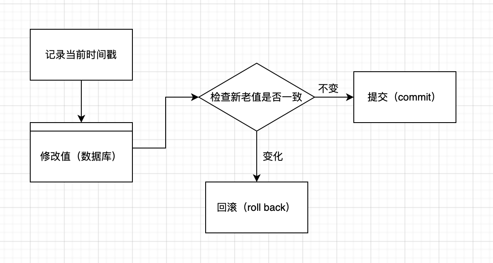

# 锁

多用户对共享资源的争用

## 并发冲突带来的影响

| 问题                            | 描述                                                         | 分析                                                         |
| ------------------------------- | ------------------------------------------------------------ | ------------------------------------------------------------ |
| 脏读（Dirty reads）             | 当一个事务正在读取一条记录，正执行到一半；另一个事务已经完成了操作。 | 1. A 用户与 B 用户都读取 v 值为 “5”<br />2. B 将 v 更改为 “2”<br />3. A 此时已经读取的值还是 5，此时已经发生脏读 |
| 不可重复读（Unrepeatable read） | 每次读取数据的时候数据不一致，这就是 “不可重复读” 问题       | 1. A 读取 v 值为 5<br />2. B 读取 v 并更改为 2<br />3. A 刷新并读取 v 值变为 2，出乎 A 的意料，不可重复读 |
| 幻影行，幻读（Phantom Rows）    | 如果 "UPDATE" 和 "DELETE" 语句都不影响数据，那这就是幻读问题 | 1. A 更改所有的值 v 为 2<br />2. B 插入一个新记录 v 值为 2<br />3. A 选择 v 值为 2 的所有记录，他会发现多了一条 2 的记录，这就是幻读 |
| 丢失更新（Lost Updates）        | 更新丢失的场景发生在当一个更新操作成功之后，被其他事务重新覆写了 | 1. A 将所有 v 值为 5 的更新为 2<br />2. 这时 B 将所有 v 值为 2 的更新为 5<br />3. A 用户的操作已经丢失了 |

## 解决问题

总起来说就是使用乐观锁和悲观锁

### 什么是乐观锁

就如命名一样，它假使多个事务互相不受影响的运行。换句话就是说在当它们执行的时候，不会面临锁。这个事务只是验证没有其他事务来修改这个数据。提交的时候，如果这个数据被修改，就会被回滚。

### 乐观锁工作原理

您可以通过多种方式来实现乐观锁，但是本质上实现乐观锁的方式都是一样的。就是下面 5 个步骤：

- 记录当前的时间戳
- 开始更新记录中的某个值
- 在更新之前，通过旧时间戳和新时间戳来检查是否有其他事务已经更改了这个值
- 如果它们（更改的值）不相等，则回滚否则提交



### 我们能通过什么方案来实现乐观锁

这里主要有三种方式，我们用 .NET 来实现乐观锁：

- Datasets：DataSet 默认是通过乐观锁实现的。它们在更新之前会检查新值与旧值
- 时间戳（Timestamp）数据类型：在你的表中创建一个时间戳数据类型，并且在更新时检查旧的时间戳是否等于新的时间戳
- 检查新旧值：获取值，在最后更新的时候，检查旧值与当前值在数据库中是相等时，如果相等更新，否则不更新

## DataSet

虽然目前 Ado.Net 的时代已经过去了，但是我们还是回顾一下 DataSet 是如何实现乐观锁的吧。

```c#
DataSet objDataset = new DataSet();
SqlDataAdapter sqlAdapter = new SqlDataAdapter(sql, connectionString);
sqlAdapter.Fill(objDataset);

objDataset.UpdateCommand = sqlcommand;
objDataset.Tables[0].Rows[0][3] = "newValue";
sqlAdapter.Update(objDataset);	// 报错，DbConcurrentcyException
```

如果你运行就会发现，更新语句触发了检查当前值与旧值是否一样

```sql
UPDATE TABLE_NAME SET [AuthorName] = @p1 WHERE (([Id] = @p2) AND ((@p3 = 1 AND [ItemName] IS NULL) OR ([ItemName] = @p4)) AND ((@p5 = 1 AND [Type] IS NULL)                                                                                                                            OR ([Type] = @p6)) AND ((@p7 = 1 AND [AuthorName] IS NULL) OR ([AuthorName] = @p8)) AND ((@p9 = 1 AND [Vendor] IS NULL) OR ([Vendor] = @p10)))',N'@p1 
nvarchar(11),@p2 int,@p3 
int,@p4 nvarchar(4),@p5 int,@p6 int,@p7 int,@p8 nvarchar(18),@p9 int,@p10 
nvarchar(2)',@p1=N'this is new',@p2=2,@p3=0,@p4=N'1001',@p5=0,@p6=3,@p7=0,@p8=N'This is Old 
Author',@p9=0,@p10=N'kk
```

这种情况下，我们尝试更改字段值 “AuthorName” 为 “This is new”，但是当更新它的时候，检查到了这个值的旧值是 “This is old author”。下面这段精简的 SQL 代码片段，它显示用旧值比较。

```sql
,@p8=N'This is Old Author'
```

## 使用时间戳数据类型

另一种方式实现乐观锁就是使用 “Timestamp” 数据类型（数据库的一种数据类型）。时间戳会在数据库每次更新的时候自动生成一个唯一的二进制数。Timestamp 数据类型相当于你记录的版本。

```sql
ALTER TABLE Table_Name ADD CurrentTimestamp TIMESTAMP NOT NULL
```

我们首次获取旧 “Timestamp” 值，并且当尝试更新操作时检查旧时间戳字段是否与当前时间戳字段相同。就如同下面这段代码

```sql
UPDATE Table_Name SET ItemName = @itemName WHERE CurrentTimestamp = @oldTimestamp
```

然后就会检查我们的更新是否执行成功，在这个例子中我们并没有发生更新，并触发了一次错误。就像下面这段代码显示的一样

```sql
if(@@rowcount=0)
begin
raiserror('Hello some else changed the value',16,10)
end
```

## 检查新旧值

大多时候我们都愿意去在主要的字段上做并发检查，比如忽略主键。对于那些场景，我们可以检查新值与旧值是否相等，在更新的时候。如下面代码片段：

```sql
UPDATE Table_Name SET Itemname = @itemName WHERE ItemName = @oldItemName
```

## 乐观锁好想没有真正解决问题？

没错。通过使用乐观锁，你只是发现了这是并发问题。为了从根本上解决并发问题，我们还是得借助悲观锁。乐观锁就像预防，而悲观锁是实际解决问题。

### 什么是悲观锁

悲观锁是假使会发生并发/冲突问题，因此在这条记录上上锁，然后执行更新。

### 我们如何做悲观锁

我们可以通过在数据库指定 “隔离级别”，ADO.NET 级别是通过使用事务域对象。

### 我们可以获得几种悲观锁

这里有 4 种锁，共享锁，互斥锁，更新锁，意图锁。前两个锁是真正的锁，其他两个是混合锁和标记。

| 锁类别                | 何时使用                                                     | 读允许       | 写允许       |
| --------------------- | ------------------------------------------------------------ | ------------ | ------------ |
| 共享锁（共享锁）      | 当你只读并且你不想其他事务更新                               | 是           | 否           |
| 互斥锁                | 当你要更新数据并且不想让任何事务读                           | 否           | 否           |
| 更新锁                | 这是混合锁。主要用来当你执行更新操作时，它会在更新发生之前要经过多个阶段。它首先开始于共享锁，在读阶段。然后在实际更新时，它获取一个互斥锁。<br />读阶段<br />操作阶段<br />更新阶段 | <br />是是否 | <br />否否否 |
| 意图锁                | 意图锁是针对锁层级。主要用来当你在层级中锁住一个资源。例如在表中的一个共享意图锁，就意味着共享锁被放置在表的行和页上。 | NA           | NA           |
| 计划锁（Schema lock） | 当你改变表结构的时候使用此锁                                 | NO           | NO           |
| 批量更新锁            | 当你执行批量更新操作时使用此锁                               | 表级别NO     | 表级别NO     |

## 更新锁

其他锁都很好理解；唯独更新锁让人很迷惑，因为它是混合锁。在更新之前，我们会多次读取记录。那么在读期间锁是共享的，并且当实际更新的时候我们将会获得一个互斥锁。更新锁更多时候是瞬时锁。


learn from https://www.codeproject.com/Articles/114262/6-ways-of-doing-locking-in-NET-Pessimistic-and-opt